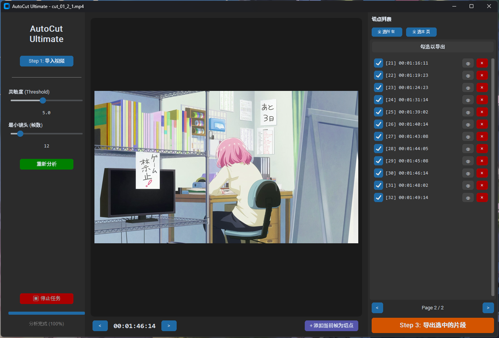

### 必读 ###

**这个小软件本来是为了应付专业导论大作业综合我个人兴趣遂利用gemini完成的，如果能帮助到别人我很高兴** ~~（虽然大概率也没人看）~~

**总而言之，能用上最好，有问题或许以后学了更多东西会做成一个更正式的软件，毕竟我觉得这软件满有用的**

**另外 除了这段话以外 这个项目的绝大部分工作均由gemni完成**  ~~感谢AI~~

# AutoCut Ultimate - 动漫分镜切片助手 ✂️🎬

  

**AutoCut Ultimate** 是一个专为 **AMV (Anime Music Video) 创作者** 和视频剪辑师设计的智能辅助工具。它能自动识别动漫视频中的镜头切换点（Cut），并允许用户在可视化的界面中进行**人工微调**，最后**无损导出**为独立的视频片段。

告别繁琐的手动切片，让创作更专注于创意本身。

---

## ✨ 核心痛点与解决方案 (Design Philosophy)

在制作 AMV 时，将一段 24 分钟的动画素材手动切分成数百个独立的镜头通常需要数小时的枯燥工作。市面上的自动工具往往存在“一刀切”的问题：要么切得太碎（把闪烁当切换），要么切不准（关键帧偏移）。

本项目采用了 **"Human-in-the-Loop" (人机协作)** 的设计理念：

1.  **算法先行 (AI Detection)**: 使用自适应阈值的 `AdaptiveDetector` 算法，能有效区分动漫中的“运镜”与“硬切”，准确率达 95% 以上。
2.  **人工兜底 (Human Review)**: 算法不可能 100% 完美，因此我们提供了一个**帧级精度的预览界面**。用户可以像在 Excel 里一样快速浏览切点，点击 "👁" 瞬时跳转预览，发现误判（如眨眼、闪光）一键删除。
3.  **所见即所得 (WYSIWYG)**: 彻底解决了算法时间码与剪辑软件（Pr/AE）不一致的问题，实现了精确到帧的导出。

---

## 🚀 主要功能 (Features)

* **📺 智能镜头识别**: 基于 `PySceneDetect` 核心，针对动漫优化的自适应算法，自动过滤快速闪烁。
* **🖱️ 交互式微调**:
    * **实时预览**: 点击列表瞬时跳转到视频对应帧，无需等待加载。
    * **手动修正**: 发现漏切的镜头？在预览区暂停，一键 `[+]` 补刀。
    * **批量管理**: 支持分页显示（解决 400+ 切点导致的 UI 卡顿），支持批量勾选导出。
* **🎞️ 帧级精确**: 独创的时间码计算逻辑，完美对齐 Adobe Premiere 的 `23.976` fps 逻辑，导出素材不丢帧、不重帧。
* **⚡ 多线程架构**: 分析与导出任务在后台线程运行，界面始终保持响应，配备实时进度条和中断功能。
* **📂 无损导出**: 调用 FFmpeg 进行 `libx264` 高质量流式剪辑，保留原画质。

---

## 🛠️ 技术栈 (Tech Stack)

* **核心语言**: Python 3.12
* **GUI 框架**: `CustomTkinter` (现代化、支持高分屏与深色模式)
* **视频算法**: `PySceneDetect` (后端核心), `OpenCV` (视频流处理与帧数计算)
* **多媒体处理**: `FFmpeg` (物理切割)
* **并发处理**: `threading` (实现由 stop_event 控制的软着陆中断机制)

---

## 📸 界面预览

<p align="center">
  
</p>

---

## 📥 快速开始 (Usage)

### 方式一：直接运行 (推荐)
1. 下载 Release 中的 `AutoCutUltimate.zip`。
2. 解压后，确保 `ffmpeg.exe` 与主程序在同一目录。
3. 双击 `AutoCutUltimate.exe` 即可使用。

### 方式二：从源码运行
1. 克隆仓库：
   ```bash
   git clone [https://github.com/YIXIDou/AutoCut-Ultimate.git](https://github.com/YIXIDou/AutoCut-Ultimate.git)
